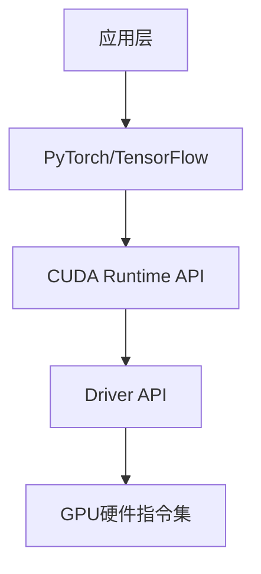

## **Torch + CUDA + NVIDIA**：

+ 安装步骤：

  1. 去 Nvidia 官网下载 CUDA 并安装（核心：驱动+CUDA开发环境）

     

     检查：`nvidia-smi` 指令

  2. 下载 Anaconda，用于运行 python 环境

  3. 下载 GPU 版本的 pytorch

     

  4. 可以开始跑深度学习了！

**Torch** 是一个深度学习框架，用于构建和训练神经网络，该可以利用**CUDA**在**NVIDIA GPU**上加速计算。通过在PyTorch中指定使用CUDA进行训练，可以在处理大数据集时大大提高计算效率。

<!--more-->

&nbsp;

### **一、硬件层：NVIDIA GPU**

#### 1. 核心作用
- **并行计算引擎**：GPU拥有数千个计算核心（如RTX 3090有10496个CUDA核心），专为高吞吐量计算设计
- **加速深度学习**：神经网络训练中的矩阵运算（如卷积、矩阵乘法）可并行化，GPU比CPU快数十倍
- **显存容量**：RTX 3090的24GB显存可承载更大模型和批量数据

#### 2. 技术演进
- **架构代际**：Ampere（30系）→ Ada Lovelace（40系）→ 未来架构
- **产品线**：GeForce RTX（如3090/4090）性价比高，适合个人开发者；Tesla/A100/H100，支持多卡互联和ECC显存

&nbsp;

### **二、驱动层：NVIDIA驱动**

硬件接口，让操作系统（如Ubuntu）识别并控制GPU。

- **内核模块**：`nvidia.ko`（Linux）或`nvllddmkm.sys`（Windows）
- **用户态库**：OpenGL/Vulkan实现、CUDA运行时

```bash
nvidia-smi               							# 查看GPU状态（温度/显存/利用率）
sudo apt install nvidia-driver-550  	# Ubuntu安装指定版本驱动
```

&nbsp;

### **三、计算平台：CUDA**

CUDA是由NVIDIA开发的一种并行计算平台和编程模型，专门用于加速图形处理单元（GPU）的计算。
深度学习训练通常需要大量的计算，CUDA让GPU能够高效地进行这些计算，大大提高了训练速度。

#### 1. 核心架构


#### 2. **CUDA的工作流程**

1. **代码编写**：在主机上编写程序代码，然后通过CUDA扩展指定哪些部分的代码需要并行化执行。
2. **内存管理**：通过CUDA API，程序需要在主机内存和GPU内存之间传输数据。GPU和CPU拥有各自独立的内存空间。
3. **并行执行**：通过指定哪些操作需要并行处理，CUDA将会把这些任务分发到GPU上的不同线程进行处理。
4. **结果回传**：GPU执行完计算任务后，将结果从GPU内存传回到CPU内存，以便后续处理。 

&nbsp;

### **四、开发环境：Ubuntu**

一个基于Linux的操作系统，广泛用于开发和服务器环境中。
Ubuntu有很多深度学习工具和库的支持，是很多深度学习开发者的首选操作系统。

#### 1. 优势
- **内核级优化**：对NVIDIA驱动支持更完善
- **包管理便捷**：`apt` + `conda` + `pip`三级管理
- **服务器兼容**：与云环境（AWS/GCP）保持一致性

#### 2. 关键配置
```bash
# 查看系统信息
uname -a                         				# 内核版本
lsb_release -a                   				# Ubuntu版本

# 安装开发工具
sudo apt install build-essential 				# GCC/CMake等
sudo apt install nvidia-cuda-toolkit 		# 完整CUDA套件
```

#### 3. 文件结构
- **驱动位置**：`/usr/lib/x86_64-linux-gnu/libcuda.so`
- **CUDA安装路径**：`/usr/local/cuda-12.4`
- **环境变量**：
  
  ```bash
  export PATH=/usr/local/cuda/bin:$PATH
  export LD_LIBRARY_PATH=/usr/local/cuda/lib64:$LD_LIBRARY_PATH
  ```

&nbsp;

### **五、框架层：PyTorch**

虽然**GPU版本的PyTorch**和**CPU版本的PyTorch**的API基本一致，但在使用上还是有一些区别。具体来说，GPU版本需要将数据和模型显式地转移到GPU设备上。

1. **设备指定**

   在PyTorch中，需要显式地指定使用哪个设备（CPU或GPU）:

   ```python
   import torch
   
   # 默认使用CPU
   device = torch.device("cpu")
   
   # 如果有可用的GPU，使用GPU
   if torch.cuda.is_available():
       device = torch.device("cuda")  		# 默认使用第一个GPU
   ```

   然后，你需要将模型和数据迁移到指定的设备上：

   ```python
   model = model.to(device)   						# 将模型转移到GPU或CPU
   input_data = input_data.to(device)  	# 将输入数据转移到GPU或CPU
   ```

2. **Tensor转移**

   要将一个Tensor从CPU转移到GPU，或者反过来，需要使用.to()方法或者.cuda()方法：

   ```python
   tensor = tensor.to(device)  					# 将tensor转移到GPU或CPU
   ```

3. **多GPU训练**

   如果有多块GPU，PyTorch还提供了DataParallel或者DistributedDataParallel来进行多GPU训练，这样可以加速训练过程:

   ```python
   model = torch.nn.DataParallel(model)  # 自动在多个GPU上训练
   ```

   

&nbsp;

